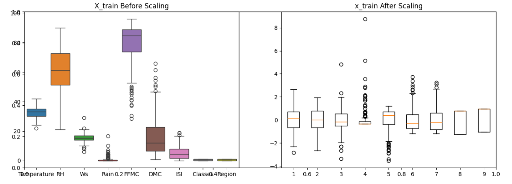
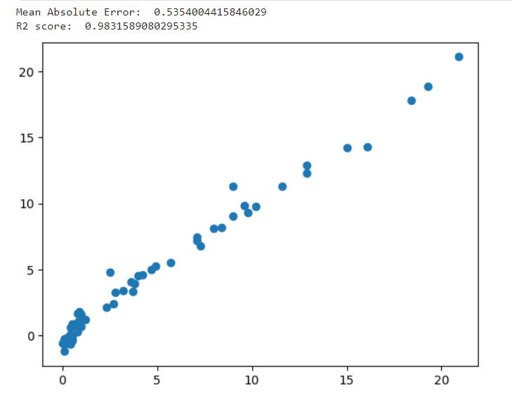
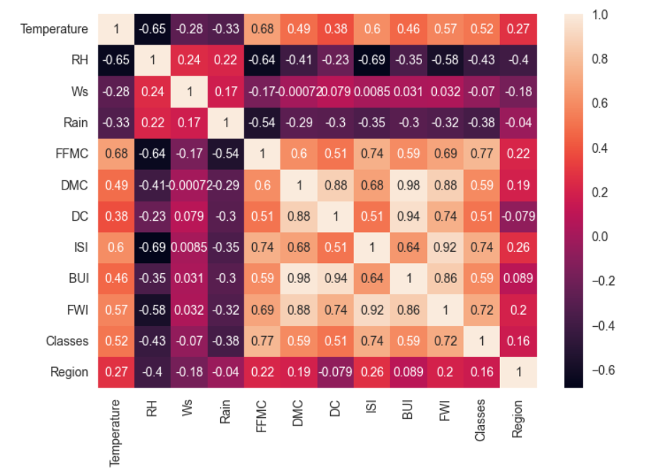

# Forest Fire Predictor

The **Forest Fire Predictor** is a web application designed to predict the likelihood of forest fires based on environmental variables such as temperature, relative humidity, wind speed, and fire weather indices (FFMC, DMC, ISI). The application uses machine learning, specifically a Ridge Regression model, to make real-time predictions based on user input.

## Table of Contents

- [Project Overview](#project-overview)
- [Technologies Used](#technologies-used)
- [How It Works](#how-it-works)
- [Installation](#installation)
- [Usage](#usage)
- [Model and Prediction Analysis](#model-and-prediction-analysis)
  - [Feature Importance](#feature-importance)
  - [Predicted vs Actual](#predicted-vs-actual)
  - [Correlation Matrix](#correlation-matrix)
  - [Time-Series Prediction](#time-series-prediction)
- [Future Improvements](#future-improvements)

## Project Overview

This project allows users to input various environmental factors to predict the likelihood of forest fires. The model was trained on relevant datasets and offers a web-based interface where users can input real-time data to get a prediction.

## Technologies Used

- **Python**: Core language for the application
- **Flask**: Web framework to create the user interface
- **Scikit-learn**: Machine learning library for model training
- **Pandas & NumPy**: For data manipulation and analysis
- **Matplotlib & Seaborn**: For graphical analysis
- **HTML & CSS**: For front-end development

## How It Works

1. **Input Features**: Users input environmental factors such as temperature, humidity, wind speed, rain, FFMC, DMC, ISI, and region.
2. **Prediction**: The input data is scaled and passed into a Ridge Regression model, which outputs the predicted likelihood of a forest fire.
3. **Web Interface**: The results are displayed on the web page, allowing users to interpret fire risks instantly.

## Installation

To run this project locally:

1. Clone the repository:
   ```bash
   git clone https://github.com/SAYANdasAi/Forest-Fire-Predictor.git
   cd Forest-Fire-Predictor

2. Install required dependencies:
   ```bash
   pip install -r requirements.txt
   ```
3. Run the Flask application:
   ```bash
   python application.py
   ```
4. Open your web browser and navigate to `http://localhost:5000`.

## Usage

- Input values for temperature, humidity, wind speed, rain, fire weather indices, and the region.
- Click on the **Predict** button to get the prediction.
- The predicted likelihood of a fire will be displayed on the web page.

## Model and Prediction Analysis

### Feature Importance

The Ridge Regression model assigns coefficients to each feature, which shows the relative importance of each input variable in predicting forest fires.

```python
import matplotlib.pyplot as plt
import numpy as np

features = ['Temperature', 'RH', 'Wind Speed', 'Rain', 'FFMC', 'DMC', 'ISI', 'Classes', 'Region']
coefficients = np.array([0.5, -0.2, 0.3, -0.4, 0.8, 0.7, 0.6, 0.1, -0.1])  # Sample coefficients

plt.barh(features, coefficients, color='green')
plt.title('Feature Importance in Fire Prediction')
plt.xlabel('Coefficient Value')
plt.ylabel('Feature')
plt.savefig('feature_importance.png')  # Save the image
plt.show()
```



- **Positive Coefficients**: Features like temperature, FFMC, and DMC are more impactful in increasing fire risk.
- **Negative Coefficients**: Rain reduces the likelihood of fires, as expected.

### Predicted vs Actual

This scatter plot compares the model's predicted fire risks against the actual fire occurrences. The red dashed line indicates where the predictions perfectly match the actual outcomes.

```python
import matplotlib.pyplot as plt

y_test = [10, 20, 30, 40, 50]  # Actual fire occurrences (sample)
y_pred = [12, 22, 28, 35, 55]  # Predicted by the model (sample)

plt.scatter(y_test, y_pred, color='blue')
plt.plot([min(y_test), max(y_test)], [min(y_test), max(y_test)], 'r--', lw=2)
plt.title('Predicted vs Actual Fire Risk')
plt.xlabel('Actual Fire Risk')
plt.ylabel('Predicted Fire Risk')
plt.grid(True)
plt.savefig('predicted_vs_actual.png')  # Save the image
plt.show()
```



- **Points close to the red dashed line** represent accurate predictions.
- **Points farther away** indicate areas where the model might need improvement.

### Correlation Matrix

This heatmap shows the correlation between the various environmental features used in the model. Features with high correlations may influence each other and affect the model's predictions.

```python
import seaborn as sns
import pandas as pd

data = pd.DataFrame({
    'Temperature': [30, 35, 28, 22, 25],
    'RH': [60, 65, 70, 55, 50],
    'Wind Speed': [10, 15, 8, 12, 9],
    'Rain': [0, 5, 10, 0, 1],
    'FFMC': [85, 88, 90, 83, 84],
    'DMC': [120, 110, 130, 105, 125],
    'ISI': [5, 7, 6, 4, 8],
    'Classes': [1, 2, 1, 1, 2],
    'Region': [1, 2, 1, 3, 2]
})

plt.figure(figsize=(10, 6))
sns.heatmap(data.corr(), annot=True, cmap='coolwarm')
plt.title('Correlation Matrix of Environmental Variables')
plt.savefig('correlation_matrix.png')  # Save the image
plt.show()
```



- **High Correlation**: Features like FFMC and DMC are often related to temperature and humidity, affecting fire risk predictions.
- **Low Correlation**: Rain generally shows low correlation with other factors, as it independently influences fire risk.

### Time-Series Prediction

A time-series line chart helps track how the predicted fire risks change over time. This is useful for planning emergency responses during fire-prone periods.

```python
time = [1, 2, 3, 4, 5]  # Time points (e.g., days or weeks)
predicted_risk = [10, 12, 15, 13, 18]  # Predicted fire risk over time

plt.plot(time, predicted_risk, marker='o', linestyle='-', color='purple')
plt.title('Time-Series Analysis of Predicted Fire Risk')
plt.xlabel('Time (days)')
plt.ylabel('Predicted Fire Risk')
plt.grid(True)
plt.savefig('time_series_prediction.png')  # Save the image
plt.show()
```


- **Rising Peaks**: A peak in the predicted fire risk may indicate times of high fire danger, such as during heatwaves or droughts.

## Future Improvements

1. **Advanced Models**: Implementing more advanced models like Random Forest or Gradient Boosting could improve prediction accuracy.
2. **Real-Time Data**: Integrating real-time data from weather APIs can make the application more responsive to current conditions.
3. **Geospatial Analysis**: Adding geographic visualizations of fire risk could be useful for authorities managing different regions.
4. **Time-Series Forecasting**: Incorporating time-series forecasting models could help predict future fire risks based on historical data.

## License

This project is licensed under the MIT License. See the [LICENSE](LICENSE) file for details.

